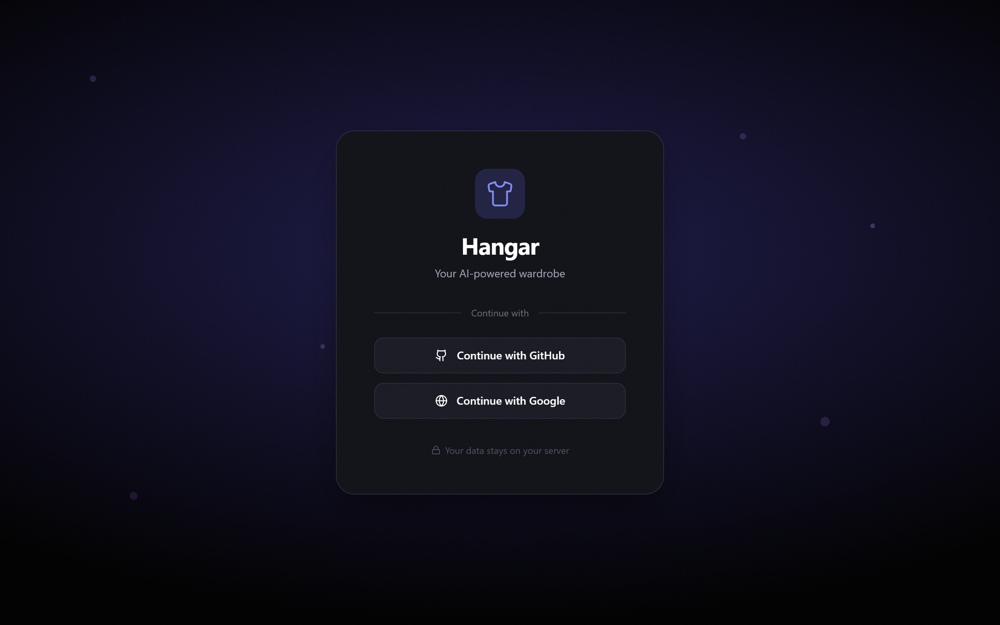
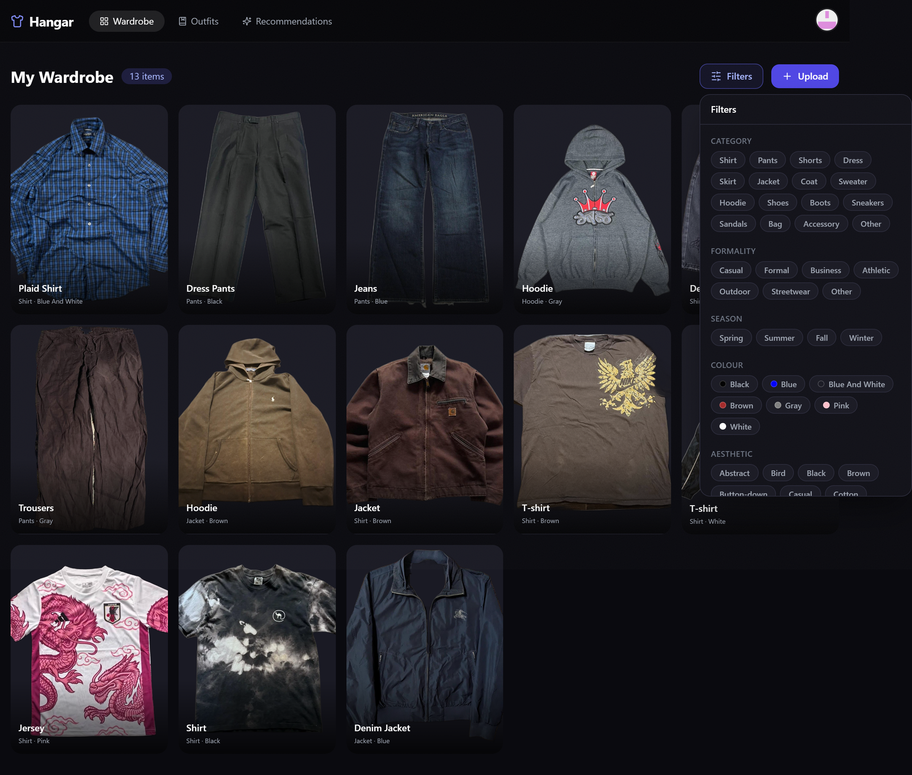
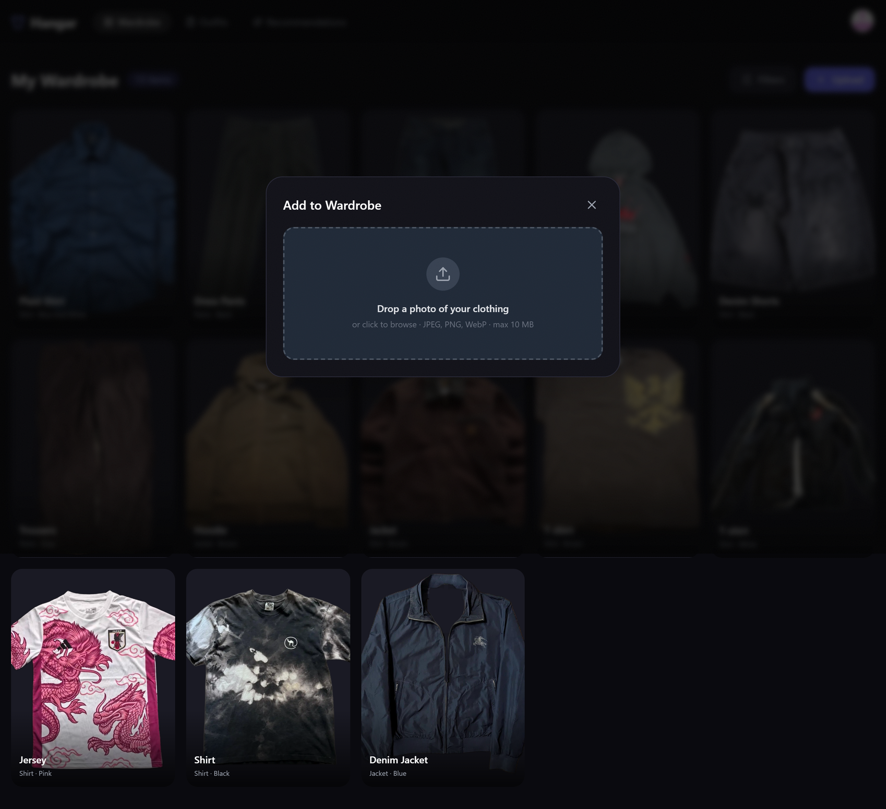
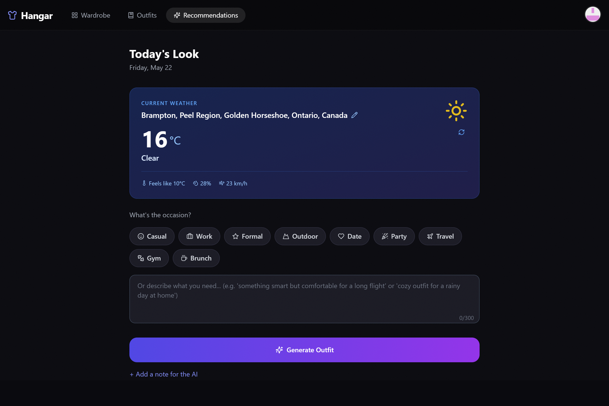
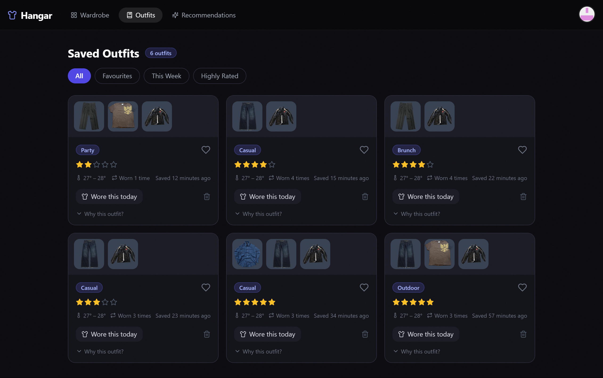

# 🧥 Hangar

**Self-hosted AI wardrobe manager. Upload your clothes, get outfit suggestions based on today's weather.**

[](https://claude.ai/code)
[](https://nextjs.org)
[](https://fastapi.tiangolo.com)
[](https://www.typescriptlang.org)
[](https://www.python.org)
[](https://www.docker.com)
[](LICENSE)

---

## Screenshots

### Login

*Clean OAuth login — no passwords to manage*

### Wardrobe

*Your wardrobe at a glance — AI fills in the details automatically*

### Upload & Analysis

*Drop a photo — AI extracts the category, colour, style, and season*

### Outfit Recommendations

*Daily outfit suggestions matched to real weather data*

### Saved Outfits

*Track what you wear, rate your outfits, and build a history*

---

## Features

- 📸 **Photo-based wardrobe** — Upload photos, AI extracts clothing type, colour, style, and season automatically
- 🌤️ **Smart recommendations** — Outfits matched to today's real weather and occasion via Open-Meteo
- 🤖 **Works with any AI** — OpenAI, Google Gemini, Ollama (free local), or any OpenAI-compatible API
- 🔐 **OAuth login** — Sign in with GitHub or Google, no passwords to manage
- 👗 **Outfit history** — Save outfits, rate them, and track how often you wear them
- 🐳 **One-command setup** — Docker Compose brings up the entire stack
- 🔒 **Fully self-hosted** — Your photos and data never leave your machine

---

## How It Works

1. **Upload a photo** — drag and drop any photo of a clothing item into your wardrobe
2. **AI analyses it** — runs in the background via a Redis job queue; automatically extracts category, colour, style, and season
3. **Get recommendations** — the app fetches today's real weather from Open-Meteo and asks the AI to pick items from your wardrobe that work well together
4. **Track your outfits** — rate outfits, log when you wore them, and save your favourites

---

## Quick Start

```bash
git clone https://github.com/Gurshaan-Deol/hangar.git
cd hangar
cp .env.example .env
```

Open `.env` and fill in your credentials (see [OAuth Setup](#oauth-setup) and [AI Configuration](#ai-configuration) below), then:

```bash
docker compose up -d
docker compose exec backend alembic upgrade head
```

| Service | URL |
|---|---|
| App | http://localhost:3000 |
| API docs (Swagger) | http://localhost:8000/docs |

---

## OAuth Setup

You need credentials from at least one OAuth provider. Both are free.

### GitHub

1. Go to [github.com/settings/developers](https://github.com/settings/developers) → **OAuth Apps** → **New OAuth App**
2. Set **Homepage URL** to `http://localhost:3000`
3. Set **Authorization callback URL** to `http://localhost:3000/api/auth/callback/github`
4. Copy the **Client ID** and generate a **Client Secret**
5. Add to `.env`:

```env
GITHUB_CLIENT_ID=your-client-id
GITHUB_CLIENT_SECRET=your-client-secret
```

### Google

1. Go to [console.cloud.google.com](https://console.cloud.google.com) → create a project → **APIs & Services** → **Credentials** → **Create OAuth client ID**
2. Set application type to **Web application**
3. Add `http://localhost:3000/api/auth/callback/google` as an authorised redirect URI
4. Copy the **Client ID** and **Client Secret**
5. Add to `.env`:

```env
GOOGLE_CLIENT_ID=your-client-id
GOOGLE_CLIENT_SECRET=your-client-secret
```

You only need one provider to get started.

---

## AI Configuration

Pick one provider and set the corresponding block in your `.env`.

### OpenAI

```env
AI_PROVIDER=openai
AI_BASE_URL=https://api.openai.com/v1
AI_API_KEY=sk-...
AI_VISION_MODEL=gpt-4o
AI_TEXT_MODEL=gpt-4o
```

### Google Gemini

```env
AI_PROVIDER=google
AI_BASE_URL=https://generativelanguage.googleapis.com/v1beta/openai
AI_API_KEY=AIza...
AI_VISION_MODEL=gemini-1.5-pro
AI_TEXT_MODEL=gemini-1.5-pro
```

### Ollama (free, runs locally)

[Install Ollama](https://ollama.com), then pull a vision model:

```bash
ollama pull gemma3:latest
```

```env
AI_PROVIDER=ollama
AI_BASE_URL=http://host.docker.internal:11434/v1
AI_API_KEY=not-needed
AI_VISION_MODEL=gemma3:latest
AI_TEXT_MODEL=gemma3:latest
```

---

## Architecture

```
┌─────────────────────────────────────────────────────────┐
│                        Browser                          │
└─────────────────────┬───────────────────────────────────┘
                      │ HTTP
┌─────────────────────▼───────────────────────────────────┐
│            Frontend — Next.js 14 (:3000)                │
│  • App Router + TypeScript                              │
│  • NextAuth.js v5 (GitHub / Google OAuth)               │
│  • TanStack Query for server state                      │
│  • Proxies /api/v1/* to backend with auth token         │
└─────────────────────┬───────────────────────────────────┘
                      │ REST API
┌─────────────────────▼───────────────────────────────────┐
│             Backend — FastAPI (:8000)                   │
│  • Async SQLAlchemy + Pydantic v2                       │
│  • JWT auth via NextAuth secret                         │
│  • Clothing CRUD + file upload                          │
│  • Outfit recommendations + history                     │
└──────┬──────────────┬────────────────┬──────────────────┘
       │              │                │
┌──────▼──────┐ ┌─────▼──────┐ ┌──────▼──────────────────┐
│ PostgreSQL  │ │  Redis 7   │ │      arq Worker          │
│     15      │ │            │ │  • Picks up analysis jobs│
│             │ │ Job queue  │ │  • Preprocesses images   │
│ Users       │ │ Weather    │ │  • Calls AI provider     │
│ Clothing    │ │ cache      │ │  • Updates item status   │
│ Outfits     │ │            │ │  • Retries on failure    │
└─────────────┘ └────────────┘ └──────────────────────────┘
                                          │
                               ┌──────────▼──────────────┐
                               │      AI Provider         │
                               │  OpenAI / Gemini / Ollama│
                               └─────────────────────────┘
```

Photo uploads are analysed in the background by an **arq worker** so the HTTP request returns immediately. The frontend polls the item's `status` field (`pending` → `analyzing` → `ready`) to show live progress.

---

## Tech Stack

| Layer | Technology |
|---|---|
| Frontend | Next.js 14, TypeScript, TanStack Query v5, Tailwind CSS, shadcn/ui |
| Backend | FastAPI 0.111, SQLAlchemy 2.0 (async), Pydantic v2, Python 3.11+ |
| Database | PostgreSQL 15 |
| Cache + Queue | Redis 7 + arq |
| Auth | NextAuth.js v5 (GitHub + Google OAuth) |
| AI | Any OpenAI-compatible API (OpenAI, Gemini, Ollama, …) |
| Weather | [Open-Meteo](https://open-meteo.com) — free, no API key needed |
| Deployment | Docker + Docker Compose |

---

## Environment Variables

Full reference for every variable in `.env.example`:

| Variable | Required | Description |
|---|---|---|
| `NEXTAUTH_URL` | Yes | Frontend URL — `http://localhost:3000` in dev |
| `NEXTAUTH_SECRET` | Yes | Random string ≥32 chars — run `node -e "console.log(require('crypto').randomBytes(32).toString('hex'))"` |
| `POSTGRES_USER` | Yes | PostgreSQL username |
| `POSTGRES_PASSWORD` | Yes | PostgreSQL password |
| `POSTGRES_DB` | Yes | PostgreSQL database name |
| `DATABASE_URL` | Yes | Full async connection string — must match the postgres vars above |
| `REDIS_URL` | Yes | Redis connection string — `redis://redis:6379` in Docker |
| `GITHUB_CLIENT_ID` | OAuth | GitHub OAuth app client ID |
| `GITHUB_CLIENT_SECRET` | OAuth | GitHub OAuth app client secret |
| `GOOGLE_CLIENT_ID` | OAuth | Google OAuth app client ID |
| `GOOGLE_CLIENT_SECRET` | OAuth | Google OAuth app client secret |
| `AI_PROVIDER` | Yes | `openai`, `google`, or `ollama` |
| `AI_BASE_URL` | Yes | API base URL for the chosen provider |
| `AI_API_KEY` | Yes* | API key — set to `not-needed` for Ollama |
| `AI_VISION_MODEL` | Yes | Model used for image analysis |
| `AI_TEXT_MODEL` | Yes | Model used for outfit recommendations |
| `WEATHER_LAT` | Yes | Default latitude for weather lookups |
| `WEATHER_LON` | Yes | Default longitude for weather lookups |
| `UPLOAD_DIR` | Yes | Path inside the container where photos are stored |
| `MAX_UPLOAD_SIZE_MB` | Yes | Maximum upload file size in MB |
| `ALLOWED_ORIGINS` | Yes | CORS allowed origins — `http://localhost:3000` in dev |

---

## Development

Start all services with hot reload:

```bash
docker compose -f docker-compose.yml -f docker-compose.dev.yml up -d
```

Tail logs:

```bash
docker compose logs -f frontend backend worker
```

Run tests:

```bash
docker compose exec backend pytest tests/ -v
docker compose exec frontend npm test -- --watchAll=false
```

Lint the backend:

```bash
docker compose exec backend ruff check app/
```

Type check the frontend:

```bash
docker compose exec frontend npx tsc --noEmit
```

Stop everything:

```bash
docker compose down
```

---

## Requirements

- **Docker Desktop** (includes Docker Compose)
- **4 GB RAM** minimum — 8 GB recommended if running Ollama locally
- **GitHub or Google account** — for OAuth (both are free)
- **An AI provider** — Ollama is free and runs entirely on your machine; OpenAI and Google Gemini have pay-per-use APIs

---

## Contributing

Contributions are welcome. To get started:

```bash
git clone https://github.com/Gurshaan-Deol/hangar.git
cd hangar

# Start in dev mode with hot reload
docker compose -f docker-compose.yml -f docker-compose.dev.yml up -d

# Run tests
docker compose exec backend pytest tests/ -v
docker compose exec frontend npm test -- --watchAll=false
```

Please open an issue before submitting a large PR so we can discuss the approach. Commit messages follow [Conventional Commits](https://www.conventionalcommits.org).

---

## Troubleshooting

**`docker compose up` fails with a database error**
```bash
docker compose exec backend alembic upgrade head
```

**AI analysis always fails**

Check the worker logs:
```bash
docker compose logs worker --tail=50
```
Common causes: wrong `AI_API_KEY`, model not available in Ollama, or `AI_BASE_URL` unreachable from inside Docker. For Ollama, make sure you have pulled the model first:
```bash
ollama pull gemma3:latest
```

**OAuth login fails with a "Configuration" error**

Make sure `NEXTAUTH_SECRET` is at least 32 characters and `NEXTAUTH_URL` exactly matches the URL you are accessing the app at.

**Photos not loading after upload**

Photos are served through an authenticated endpoint. Make sure you are signed in and the backend is running:
```bash
docker compose logs backend --tail=20
```

**Ollama is slow to analyse images**

Small models like `gemma3` may take 30–60 seconds per image on CPU. Consider using a GPU-accelerated Ollama setup, or switch to `gpt-4o` or `gemini-1.5-pro` for faster analysis.

---

## License

[MIT](LICENSE)

<!-- Suggested GitHub topics: wardrobe ai self-hosted nextjs fastapi docker ollama openai outfit-recommendations personal-assistant -->
